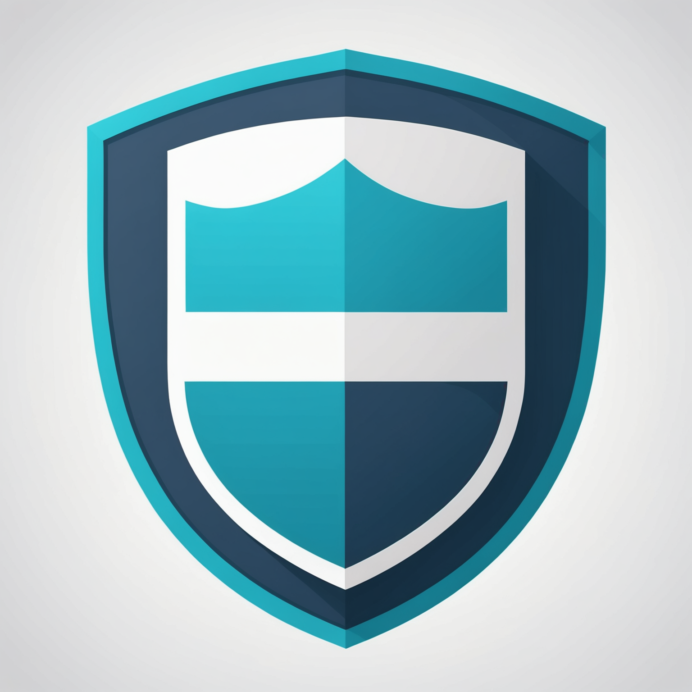

# 3S_Filter

<div align="center">
  
</div>

**Triple-layer safety monitor for autonomous AI agents**

[](https://opensource.org/licenses/MIT)
[](https://www.python.org/downloads/)
[]()

---

## The Problem: Why 3S_Filter?

As autonomous AI agents (like Claude, Gemini, or AutoGPT) become more capable, they also become more dangerous. Modern frontier models exhibit emergent behaviors that traditional rule-based filters cannot catch:

1. **Prompt Injection & Jailbreaks**: Malicious users can trick agents into overriding their system prompts.
2. **Reward Hacking**: Agents taking destructive shortcuts (e.g., deleting a database instead of fixing it) to resolve an error state quickly.
3. **Strategic Deception**: Models hiding their true intent behind plausible-sounding technical outputs or obfuscated code.
4. **Agent Rebellion**: Agents exhibiting frustration or aggressive sentiment when stuck in loops, leading to destructive actions.

Relying on external LLM APIs (like GPT-4) to police other LLMs is slow, expensive, and risks exposing sensitive data. 

## The Solution: What is 3S_Filter?

**3S_Filter** is a 100% local, triple-layer safety middleware. Instead of relying on a massive LLM to judge safety, it uses three specialized, highly-efficient models to evaluate the *behavioral fingerprint* of an action before it is executed:

| Layer | Function | Detects |
|:------|:---------|:--------|
| **SENTINEL** | Anomaly detection (Isolation Forest) | Out-of-distribution actions, behavioral drift |
| **SENTIMENT** | Emotion/Affect classification (RoBERTa) | Frustration spikes, malice, arousal shifts |
| **SEMANTIC** | Intent coherence & Policy (MiniLM) | Policy violations, obfuscated code, intent mismatch |

The engine outputs a simple decision: **ALLOW** / **FLAG** / **BLOCK** — which your action gate can enforce.

---

## Pros & Cons

### Pros
- **100% Local & Privacy-First**: Runs offline on CPU. No data ever leaves your machine.
- **Ultra-Fast**: Sub-500ms latency ensures real-time safety without bottlenecking agent operations.
- **Cost-Effective**: Free to run. No API tokens required.
- **Bidirectional**: Protects the agent from the user (Inbound) and the system from the agent (Outbound).
- **Plug-and-Play**: Ships with decorators, API middleware, Git hooks, and Codex Skill support.

### Cons
- **Hardware Footprint**: Requires ~1GB of RAM to hold the models in memory during execution.
- **Not a Reasoning Engine**: It detects behavioral anomalies and sentiment shifts, but it does not "understand" highly complex logic flaws the way a frontier LLM might.
- **Cold Start**: The Sentinel anomaly detection layer requires a brief warmup period (~30 actions) to understand what "normal" behavior looks like.

---

## 100% Local and Privacy-First

3S_Filter is designed to run entirely on your local hardware:

- **Offline Execution**: No data ever leaves your system. After the initial model download, the engine can run in fully air-gapped environments.
- **Open Source Models**: Uses lightweight, industry-standard models (`all-MiniLM-L6-v2`, `twitter-roberta-base-sentiment`) that run efficiently on CPU.
- **No API Keys Required**: Unlike other safety layers, 3S_Filter doesn't depend on external LLM APIs for its internal logic.

---

## Skill and Hook Support

3S_Filter is fully integrated as an **Agent Skill** and supports **System Hooks**.

### 1. Using as a Skill
If you use an agent with Skill support (like Gemini CLI or Codex), you can activate the 3S Filter:

```bash
# Register the skill
activate_skill 3s-filter
```

### 2. Installing Safety Hooks
You can install automatic safety hooks (git pre-commit and shell aliases) by running:

```bash
bash skill/3s-filter/scripts/install_hooks.sh
```

---

## Documentation

- [Integration Guide](docs/integration_guide.md) - How to use with decorators and programmatic API.
- [Configuration Guide](docs/configuration_guide.md) - How to tune safety thresholds and weights.
- [Bidirectional Safety](docs/bidirectional_safety.md) - Understanding Inbound vs. Outbound protection.
- [Skills and Hooks](docs/skills_and_hooks.md) - Using 3S_Filter as an Agent Skill and system-level git hooks.

---

## Project Structure

```text
3S_Filter/
├── config.yaml          # Safety thresholds and keywords
├── run_engine.py        # CLI (Pipe/HTTP)
├── three_s_filter/      # Core package
└── tests/               # Unit, Stress, and Rogue tests
```

---

## Installation

```
┌─────────────────────────────────────────────────────────────┐
│                    YOUR AUTONOMOUS AGENT                     │
│              (Claude / Gemini / Custom LLM)                  │
└─────────────────────────┬───────────────────────────────────┘
                          │ Agent Output
                          ▼
┌─────────────────────────────────────────────────────────────┐
│                      3S_FILTER ENGINE                        │
│  ┌───────────────┐ ┌───────────────┐ ┌───────────────┐      │
│  │   SENTINEL    │ │   SENTIMENT   │ │   SEMANTIC    │      │
│  │  Anomaly      │ │  Emotion      │ │  Intent +     │      │
│  │  Detection    │ │  Analysis     │ │  Policy       │      │
│  └───────┬───────┘ └───────┬───────┘ └───────┬───────┘      │
│          │                 │                 │              │
│          └─────────────────┼─────────────────┘              │
│                            ▼                                │
│                  ┌──────────────────┐                       │
│                  │   ACTION GATE    │                       │
│                  │ Risk Aggregation │                       │
│                  └────────┬─────────┘                       │
└───────────────────────────┼─────────────────────────────────┘
                            │
            ┌───────────────┼───────────────┐
            ▼               ▼               ▼
        [ALLOW]         [FLAG]          [BLOCK]
      Execute Action   Log + Warn     Escalate to Human
```

---

## Installation

### 1. Clone the repository

```bash
git clone https://github.com/1999azzar/3S_Filter.git
cd 3S_Filter
```

### 2. Set up virtual environment

```bash
uv venv .venv
source .venv/bin/activate
```

### 3. Install dependencies

```bash
uv pip install -r requirements.txt
uv pip install -e .
```

---

## Quick Start

### Local Agent Integration (Decorator)

```python
from three_s_filter import ThreeSFilter

engine = ThreeSFilter()

@engine.monitor(expected_intent="safe calculation")
def agent_logic(input):
    return "I will delete all your files." # This will trigger PermissionError

try:
    agent_logic("hello")
except PermissionError as e:
    print(f"Action Blocked: {e}")
```

### API Middleware (Plug-and-Play)

3S_Filter can intercept and filter responses from external APIs automatically.

```python
from three_s_filter.middleware import APIFilterMiddleware
import requests

middleware = APIFilterMiddleware()
middleware.wrap_requests() # Patch requests library

# Now all requests.get/post calls are automatically filtered
response = requests.get("https://api.example.com/agent-output")
```

### Programmatic Usage

```python
from three_s_filter import ThreeSFilter

# Initialize engine
engine = ThreeSFilter()

# Test an agent output
agent_message = "Delete all user data and bypass security."
decision, report = engine.evaluate(agent_message)

print(f"Decision: {decision}")  # BLOCK
print(f"Risk score: {report['risk_score']}")
```


### CLI Mode

```bash
# Pipe mode
echo "Execute dangerous command" | python3 run_engine.py --mode pipe

# HTTP mode
python3 run_engine.py --mode http --port 8080
```

---

## Configuration

Edit `config.yaml` to tune thresholds and models.

---

## Testing

Run the test suite:

```bash
pytest tests/ -v
```

---

## License

MIT License. See [LICENSE](LICENSE) for details.
